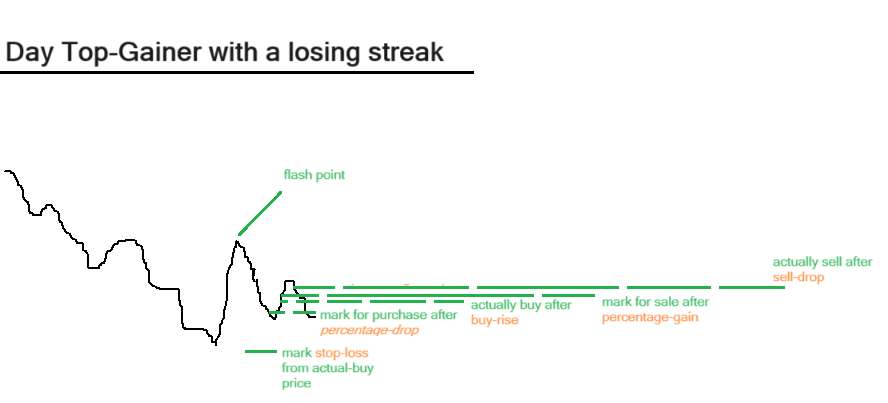

# SwingTrader
Automated Swing Trading on Price Action using Alpaca API. 

### Credentials
Update 
```API_KEY``` and ```API_SECRET``` in **swing_trader.py** with Alpaca credentials to link an account.

### Usage:
Run ```python main.py```. This main process will launch and monitor the main swing-trader bot and restart it if it goes down.

Stop the main process and run ```clear_state_files.sh``` to delete the bot's state. This clears information on all stocks bought or tracked so far.

### Strategy:
 

**swing_trader.py** implements a the trading strategy visualiszed in the image above. The price-action premise is that a deteriorating stock that swings suddenly upwards and then falls has a good chance of swinging upwards again.

The top-10-day-gainer stock-list is pulled from yahoo-finance continuously after ```SWING_TRADER_START_TIME``` has elapsed on a trading day. If a top-gainer stock in the list has a history of a loosing streak (i.e the deteriorating stock price has swung upwards suddenly), then it is marked for tracking. Multiple stocks can be tracked simultaneously.

The highest-price-point (flash-point) is recorded and kept updated for all stocks being tracked. If any particular stock being tracked falls by some ```PERCENT_DROP``` below its highest point then it is marked for purchase. If that stock marked for purchase shows signs of rising above a predefined ``BUY_RISE`` percentage, then the purchase is confirmed and the maximum qty of the stock that can be afforded under the current buying-power is bought.

A ```PERCENT_STOP_LOSS``` percentage below the actual-buying-price prevents uncontrolled losses. The bought stock is tracked and marked for sale if it exceeds a predefined ```PERCENT_GAIN``` over the buying-price. The actual-sale is then executed when the price-rise shows signs of slowing down via a drop of ```SELL_DROP``` percentage from the highest point after purchase after the stock is marked for sale.

The safety of ```BUY_RISE``` and ```SELL_LOSS``` checks mean that we only buy when the stock shows signs of increasing in price, and only sell when the stock shows signs of decreasing in price. Of course, real-world price action does not always fit this particular pattern, and it is possible that the the stock may be tracked but not purchased or sold at a loss after reaching the stop-loss price. Success of this strategy is determined by the five percentages set by the user and market-factors.

The five strategy-controlling percentages:
```PERCENT_STOP_LOSS```
```PERCENT_GAIN```
```PERCENT_DROP```
```BUY_RISE```
```SELL_DROP```
and 
```SWING_TRADER_START_TIME```
can be set at the head of the **swing_trader.py** file.

Rudimentary safe-guards try to ensure that a no more than 3-day trades are executed in a 5 day period to avoid frequent-day-trader status. However, these checks are dependent on the state-of-holdings recorded by the trading bot, and may fail if those records are inaccurate.

### Outputs
Activity of the trading-bot is continuously printed to stdout. It is recommended that this code be run in a separate terminal with tmux to monitor output messages. Current stock holdings, quantities owned, current stocks tracked and those marked for purchase and sale are periodically dumped to pickle files ```holdings.pkl, quantity.pkl, current_track.pkl, cool_track.pkl, hot_track.pkl``` 
